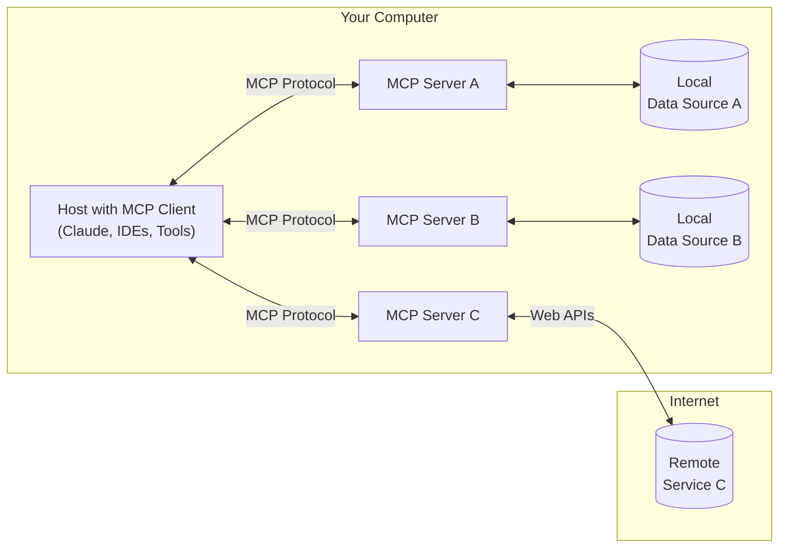
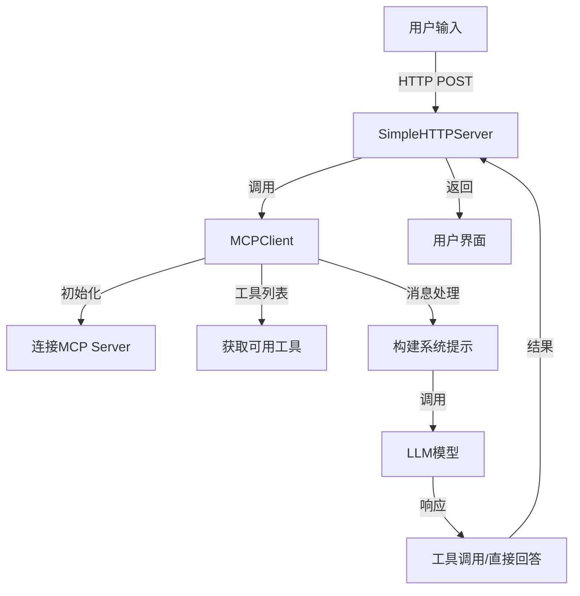

# Mcp server很火，但是你知道Mcp Client是什么嘛？

当整个技术圈都在热议Mcp Server的革命性突破时，一个关键角色正悄悄成为系统成败的隐形推手——Mcp Client。如果没有Mcp Client，Mcp Server的存在将毫无意义。那到底什么是Mcp Client呢？

## 什么是Mcp Client



通俗来讲，Mcp Client是Mcp Server的直接使用者，它扮演着沟通桥梁的角色。用户通过Mcp Client与Mcp Server进行交互，发送指令并接收反馈。Mcp Client的存在使得用户无需直接与Mcp Server打交道，极大地简化了操作流程。

一个优秀的Mcp Client，可以同时链接多个Mcp Server，并且可以通过使用不同的工具，来与大模型进行对话，从而更灵活、更丰富的效果。

> 附上市面上常用的支持Mcp的客户端：https://modelcontextprotocol.io/clients

## 如何实现一个Mcp Client

首先我们要知道，Mcp Server实际上就是一个可执行的 python 文件或者是 js 文件。我们可以通过查看源码的形式来了解它是如何进行链接的。

```js
// modulecontextprotocol/sdk/dist/shared/protocol.js
class Protocol {

  //...
  async connect(transport) {
        this._transport = transport;
        this._transport.onclose = () => {
            this._onclose();
        };
        this._transport.onerror = (error) => {
            this._onerror(error);
        };
        this._transport.onmessage = (message) => {
           //...
        };
        await this._transport.start();
    }
}

```

可见，Mcp Server 底层就是通过管道通信来实现的。因此我们可以通过管道通信来建立链接。

比如如果想要链接文件系统Mcp，我们可以这样做：

```typescript
const ServerConfig = {
  filesystem: {
    command: 'npx',
    args: ['-y', '@modelcontextprotocol/server-filesystem', __dirname],
  },
};

const { command, args } = ServerConfig.filesystem;
  this.childProcess = spawn(command, args, {
    stdio: ['pipe', 'pipe', 'inherit'], 
});

const rl = createInterface({
  input: this.childProcess.stdout!,
  output: this.childProcess.stdin!,
  terminal: false,
});

// 通过line事件，监听Mcp Sever回传的消息
rl.on('line', (line: string) => this.handleMcpMessage(Buffer.from(line)));

```

通过简单几行代码，我们已经实现了与Mcp Server的链接。

### 2. 智能对话状态管理
通过精巧的消息流设计，系统能记住完整对话上下文：
```typescript
// 消息格式化与存储
this.chatHistory.push(formatUserMeesgae(message));
const response = await this.callLLM(this.chatHistory);
this.chatHistory.push(formatAssistantMeesgae(response));
```
配合`<mcfile name="prompt.ts" path="/Users/bytedance/workspace/nan/server/prompt.ts"></mcfile>`中的动态提示构建，实现了真正意义上的上下文感知对话。

## 🏗️ 架构设计：优雅的分层解耦



核心亮点在于`<mcfile name="index.ts" path="/Users/bytedance/workspace/nan/server/index.ts"></mcfile>`实现的HTTP服务器与业务逻辑的完美分离：
- **路由注册机制**：通过`registerRoute`方法实现接口的模块化管理
- **请求处理流程**：标准化的请求解析与错误处理
- **MCP Client集成**：松耦合设计便于替换不同版本的客户端实现

## 💎 代码解析：细节之处见真章

### 1. 健壮的进程管理
```typescript
// MCP Server进程启动与监控
this.childProcess = spawn(command, args, { stdio: ['pipe', 'pipe', 'inherit'] });
this.childProcess.on('exit', (code) => {
  console.log(`MCP Server process exited with code ${code}`);
  rl.close();
});
```
通过子进程管理与事件监听，确保了与MCP Server通信的稳定性。

### 2. 智能超时控制
```typescript
// 请求超时处理
setTimeout(() => {
  if (this.requestStack.has(requestId)) {
    this.requestStack.delete(requestId);
    reject(new Error('Request timeout'));
  }
}, this.timeout);
```
防止因网络波动或Server异常导致的客户端僵死。

### 3. 类型安全设计
通过TypeScript接口严格定义消息结构：
```typescript
interface Message {
  role: Role;
  content: string;
  type?: MessageType;
  timestamp?: number;
}
```
从源头避免了数据格式错误。

## 📝 实战启示：构建高性能AI客户端

1. **双向通信设计**：采用JSON-RPC协议实现与Server的高效通信
2. **工具抽象层**：统一函数型与RPC型工具的调用接口
3. **状态隔离机制**：通过请求ID管理确保并发处理安全
4. **优雅降级策略**：超时处理与错误恢复机制保障系统韧性

MCP Client的设计哲学告诉我们：优秀的AI交互系统不仅需要强大的算法支撑，更需要精巧的工程实现。这个看似简单的客户端组件，实则是连接大语言模型与业务场景的关键纽带。

