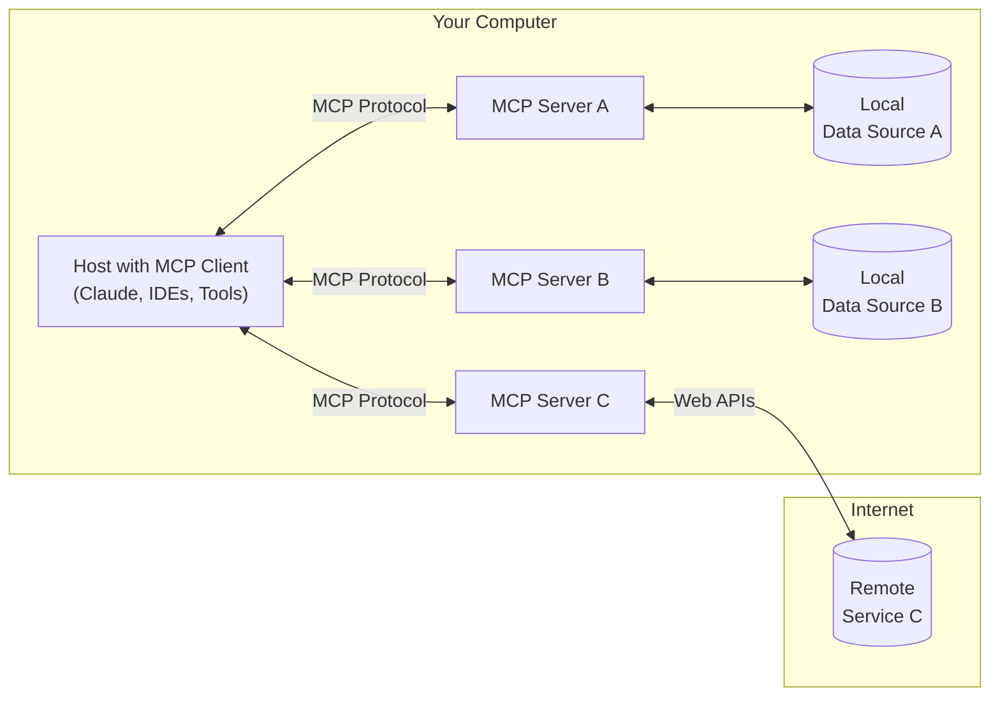

# Mcp server很火，但是你知道Mcp Client是什么嘛？

当整个技术圈都在热议Mcp Server的革命性突破时，一个关键角色正悄悄成为系统成败的隐形推手——Mcp Client。如果没有Mcp Client，Mcp Server的存在将毫无意义。那到底什么是Mcp Client呢？

## 什么是Mcp Client



通俗来讲，Mcp Client是Mcp Server的直接使用者，它扮演着沟通桥梁的角色。用户通过Mcp Client与Mcp Server进行交互，发送指令并接收反馈。Mcp Client的存在使得用户无需直接与Mcp Server打交道，极大地简化了操作流程。

一个优秀的Mcp Client，可以同时链接多个Mcp Server，并且可以通过使用不同的工具，来与大模型进行对话，从而更灵活、更丰富的效果。

> 附上市面上常用的支持Mcp的客户端：https://modelcontextprotocol.io/clients

## 如何从0实现一个Mcp Client

### 1. 与 Mcp Server 建立连接

首先我们要知道，Mcp Server实际上就是一个可执行的 python 文件或者是 js 文件。我们可以通过查看源码的形式来了解它是如何进行链接的。

```js
// modulecontextprotocol/sdk/dist/shared/protocol.js
class Protocol {

  //...
  async connect(transport) {
        this._transport = transport;
        this._transport.onclose = () => {
            this._onclose();
        };
        this._transport.onerror = (error) => {
            this._onerror(error);
        };
        this._transport.onmessage = (message) => {
           //...
        };
        await this._transport.start();
    }
}

```

可见，Mcp Server 底层就是通过管道通信来实现的。因此我们可以通过管道通信来建立链接。

比如如果想要链接文件系统Mcp，我们可以这样做：

```typescript
const ServerConfig = {
  filesystem: {
    command: 'npx',
    args: ['-y', '@modelcontextprotocol/server-filesystem', __dirname],
  },
};

const { command, args } = ServerConfig.filesystem;
  this.childProcess = spawn(command, args, {
    stdio: ['pipe', 'pipe', 'inherit'], 
});

const rl = createInterface({
  input: this.childProcess.stdout!,
  output: this.childProcess.stdin!,
  terminal: false,
});

// 通过line事件，监听Mcp Sever回传的消息
rl.on('line', (line: string) => this.handleMcpMessage(Buffer.from(line)));
```

通过简单几行代码，我们已经实现了与Mcp Server的链接。

当我们给 MCP Server 发送一个`initialize`请求时，MCP Server 会返回一个初始化的结果。示例如下：

```js
// send
const requestData = {
  id: requestId,
  jsonrpc: '2.0',
  method: "initialize",
};
const requestStr = JSON.stringify(requestData) + '\n';
this.childProcess?.stdin?.write(requestStr);


// received
 {
  result: {
    protocolVersion: '2024-11-05',
    capabilities: { tools: {} },
    serverInfo: { name: 'secure-filesystem-server', version: '0.2.0' }
  },
  jsonrpc: '2.0',
  id: 1
}
```

### 2. 搭建一个 ReAct 智能体

为了更加简单易懂，我准备使用基于 ReAct 的单智能体来进行模型搭建。

> ReAct 是一种极为常见的智能体架构，融合了大模型推理（Reasoning）与工具调用（Tool Using）能力。它通过将逻辑推理和行动决策有机结合，不仅能在复杂环境下高效完成任务，还能对决策过程给出清晰解释。


首先，需要通过 Open Ai 进行模型接入，这里各位就自行参考各大模型商所提供的 Api 接入指南进行操作即可。

```js
export async function sendModelRequest(prompt: Message[], maxRetries = 3, temperature = 0.8) {
  const url = process.env.LLM_URL;
  const headers = {
    'Agw-Js-Conv': 'str',
    'Content-Type': 'application/json',
    Authorization: `Bearer ${process.env.API_KEY}`,
  };
  const data = {
    model: process.env.MODEL,
    messages: prompt,
  };
  const response = await axios.post(url, data, { headers });
  return formatResponse(response.data);

}
```

然后我们需要写一个能够约束 LLM 进行 ReAct 模式进行思考的 System Prompt。

这里可以使用 Meta Prompt来去做：

```md
## role:You are an expert in logical reasoning and autonomous decision-making.
For each task, you will independently select the appropriate tools to use, provide inputs, receive results (observations), and use those observations to inform subsequent actions. This cycle continues until a stopping condition is met or sufficient information is gathered to respond to the user.

## Usable Tools

{toolStr}

## Tool Call Format

{
    "type": <工具类型>,
    "tool_name": <工具名称>,
    "params": {
        <工具参数1>: <参数值>,
        <工具参数2>: <参数值>,
    }
}

## Steps

1. Analyze the Task: Understand the user's request, identifying key objectives and constraints.
2. Select Tools: Choose the most suitable tools or methods to address the task.
3. Execute & Observe: Provide inputs to the selected tools and record the outputs (observations).
4. Evaluate & Iterate: Assess whether the observations meet the task requirements. If not, refine the approach or select new tools.
5. Conclude or Continue: Either respond to the user with the gathered information or repeat the cycle until the stopping condition is satisfied.

## Output Format

1. Provide responses in Chinese
2. If intermediate steps are needed, present them logically before the final conclusion.
For structured data (e.g., classifications, comparisons), use JSON format without code blocks.


## Notes

1. Prioritize clarity and relevance in tool selection.
2. If observations are ambiguous, request clarification or use additional tools.
3. Always conclude with a synthesized response unless further iteration is needed.
4. Not use the same tool too match times.
```

在上述 prompt 中，还需要注入可用的工具列表，这个可以通过给链接好的 Mcp Server 发送 `tools/list` 请求，即可拿到 Mcp Server 所提供的所有工具和信息。

```js
// send
const requestData = {
  id: requestId,
  jsonrpc: '2.0',
  method: "tools/list",
};
const requestStr = JSON.stringify(requestData) + '\n';
this.childProcess?.stdin?.write(requestStr);
```

#### 2.1 工具调用

当 LLM 判断需要调用工具的时候，会返回我们实现约束好的结构，因此我们可以通过解析 LLM 返回的结果，来执行工具。

```js
 private async parseLLMResponse(response: string) {
    try {
      const res = JSON.parse(response)
      const { type, content } = res;
      switch (type) {
        case 'tool_call': {
          const { tool_name, params } = res;
          try {
            // 这里的sendMcpRequest函数就是上文提到过如何向Mcp Server进行发送消息的逻辑
            const toolRes = await this.sendMcpRequest({
              method: 'tools/call',
              params: {
                name: tool_name,
                arguments: params,
              },
            });

           // ..
          } catch (error) {
            return content;
          }
        }
        default:
          return content;
      }
    } catch (error) {
      console.error('Failed to parse LLM response:', error, 'Response:', response);
    }
    return content;
  }
```

##### 2.12. 循环调用 LLM

当 MCP Server 返回相应的时候，我需要将其解析，然后再调用 LLM 进行下一轮的思考决策，直到 LLM 认为任务完成，返回最终结果。


```js
// ...
case 'tool_call': {
  const { tool_name, params } = res;
  try {
    // 这里的sendMcpRequest函数就是上文提到过如何向Mcp Server进行发送消息的逻辑
    const toolRes = await this.sendMcpRequest({
      method: 'tools/call',
      params: {
        name: tool_name,
        arguments: params,
      },
    });
     this.chatHistory.push({
      content: [
        {
          type: MessageType.Text,
          text: `调用工具${tool_name}的结果如下:${toolRes}\n请基于这个结果继续处理用户的问题。`
        },
      ],
      role: Role.User,
    })
    // 继续调用LLM
    return this.sendModelRequest(this.chatHistory)
  } catch (error) {
    return content;
  }
}
```
